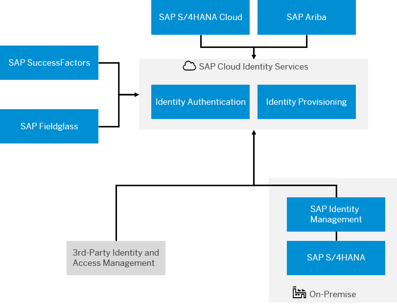
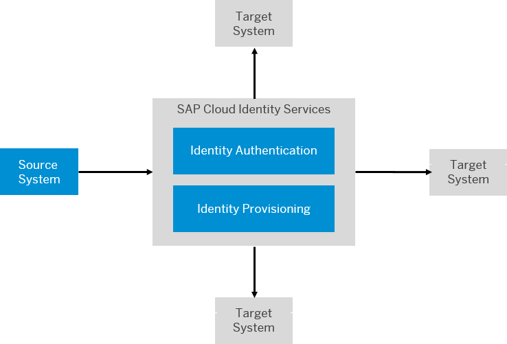
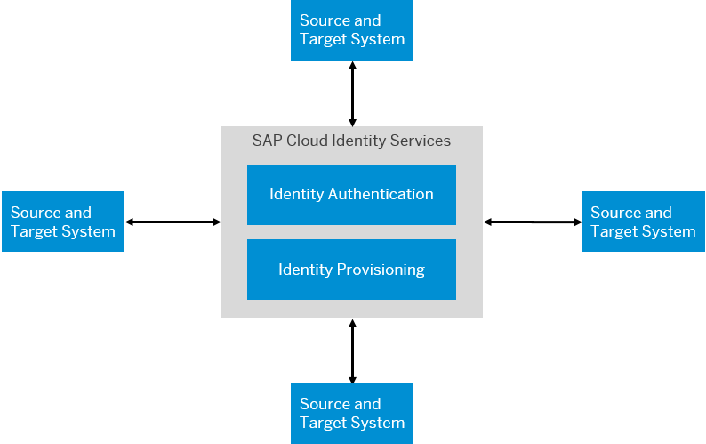

<!-- loio27947dfb325047018603446439050a6b -->

# System Integration Guide for SAP Cloud Identity Services

SAP Cloud Identity Services are a group of services of SAP Business Technology Platform \(SAP BTP\), which enable you to integrate identity and access management \(IAM\) between systems. The goal is to provide a seamless single sign-on \(SSO\) experience across systems while ensuring that system and data access are secure.

To integrate your SAP BTP services with other SAP services, ensure the following:

-   The identities of the users who consume these services are available everywhere that you need them.

-   The identities include all the data you need, such as an e-mail address or other logon alias. People need a logon alias they can remember.

-   The identities include a federation identifier so that a user can be correlated across the different systems. This global user identifier can have different names in different systems.

<a name="loio27947dfb325047018603446439050a6b__section_ejl_q35_drb"/>

## Identity and Access Management Reference Architecture

Identity Authentication enables single sign-on across the landscape. You can make Identity Authentication the central store for your identities or serve as a proxy for your corporate identity provider.

Identity Provisioning distributes users across systems. If you're a new customer, you can use Identity Authentication as your source of truth and push your identities to our services with Identity Provisioning. If you're already a customer of our services, use Identity Provisioning to pull identities from the various services to Identity Authentication. Then synchronize with services like SAP S/4HANA Cloud, SAP Ariba, SAP SuccessFactors, and SAP Fieldglass. For integration with SAP S/4HANA, we recommend using SAP Identity Management as an intermediary.

  
  
**Reference IAM Architecture**

For more information about our reference architectures, see [Scenario Recommendations](../30-scenario-recommendations/scenario-recommendations-9fc3787.md).

> ### Tip:  
> Our reference architecture is evolving to better serve the intelligent enterprise. Check out our blog series on where we're going:
> 
> -   [Single Sign-On: SAP Reference Architecture for Identity Access Management](https://blogs.sap.com/2021/09/24/single-sign-on-sap-reference-architecture-for-identity-access-management/)
> 
> -   [Identity Lifecycle: SAP Reference Architecture for Identity Access Management – Part 1](https://blogs.sap.com/2021/09/27/identity-lifecycle-sap-reference-architecture-for-identity-access-management-part-1/)

<a name="loio27947dfb325047018603446439050a6b__section_bgs_q35_drb"/>

## Identity Lifecycle

The identity lifecycle is the set of phases an identity goes through during a person's interaction with an organization. If you take the example of an employee working for an organization, there are phases in the career of the employee, which require changes to an identity.

> ### Example:  
> The following phases illustrate such an identity lifecycle:
> 
> -   Onboarding
> 
>     A person joins the organization. The identity of the person must be distributed to all systems the person must access so they can log on.
> 
> -   Working
> 
>     During career of the person, they change responsibilities, either through promotion or a lateral move or the person changes their name. Access and data for the identity must be distributed to all relevant systems that the person accesses.
> 
> -   Closing
> 
>     The person leaves the organization either through retirement or through a decision of the employee. Access needs to be removed from the participating systems. The identity must be removed or at least blocked according to local data protection and privacy regulations.

<a name="loio27947dfb325047018603446439050a6b__section_kks_dqg_krb"/>

## How to Integrate with SAP Services

The integration with SAP Cloud Identity Services requires an initial configuration and then some planning for how to continue the identity lifecycle.

> ### Note:  
> The integration we offer here tries to automate as much as possible. Some organizations prefer to maintain as much control as possible of their IAM lifecycle. For such organizations, we offer APIs.
> 
> For more information, see [SAP Cloud Identity Services](https://api.sap.com/package/SCPIdentityServices/rest) on *SAP API Business Hub*.

1.  Configure single sign-on.

    Exchange trust between the SAP service and Identity Authentication. Configure Identity Authentication to serve as the identity provider.

    Services off-load the task of authenticating users to the Identity Authentication service. Identity Authentication authenticates the user with a credential maintained by Identity Authentication or delegates the authentication request to a 3rd-party identity provider. If the authentication is successful, Identity Authentication returns a token that enables your service to identify the local user that the service needs to log on the user. If your service redirects the user to another service that consumes Identity Authentication, the user doesn't need to log on again. Instead, Identity Authentication issues another token for the other service.

    For more information, [Scenario Setup](../40-scenario-setup/scenario-setup-ae9137c.md).

2.  Configure the initial identity provisioning.

    Provision the leading systems to Identity Authentication. How you set up the provisioning depends on the architecture you follow in your organization. Even if you're brand new to SAP, your organization has some repository for users.

    Some organizations maintain a single source of truth for user identities. This single source can be your own 3rd-party IAM solution or you've decided to provision all users from your HR system.

      
      
    **Single Leading System**

    

    Other organizations draw different user identities from different systems. For example, employees from SAP SuccessFactors and contingent workers from SAP Fieldglass. Your organization can be subdivided into smaller units, each with their own leading system.

      
      
    **Multiple Leading Systems**

    

    This guide provides concrete recommendation on how to set up the initial provisioning from the leading systems to Identity Authentication.

    For more information, [Scenario Setup](../40-scenario-setup/scenario-setup-ae9137c.md).

3.  Plan and configure how Identity Provisioning distributes these users to other systems.

    Identity Provisioning ensures that users are available to all the services your users consume. The service also ensures that any changes made to the identities are communicated to all relevant systems. In this way, Identity Provisioning determines which services your users can access. However, do all your contingent workers in SAP Fieldglass need to be available in SAP S/4HANA? Do you want changes in one system to be communicated back to your HR system? These questions are questions you need to answer.

    For more information, see [Planning for Merging or Conditions for Provisioning with Identity Provisioning](../50-identity-povisioning/planning-for-merging-or-conditions-for-provisioning-with-identity-provisioning-5c48f4e.md).

**Related Information**  

[Scenario Requirements](../20-scenario-requirements/scenario-requirements-ae915d6.md "To set up your SAP cloud solutions to use the SAP Cloud Identity Services - Identity Authentication and Identity Provisioning, make sure you meet the following requirements:")

[List of Integration Scenarios](../60-integration-scenarios/list-of-integration-scenarios-f4d660f.md "This section provides details of preconfigured scenarios and tries to make you aware of any configuration options or limitations. We also provide details of configuration options used across different solutions.")

[Global User ID in Integration Scenarios](../60-integration-scenarios/global-user-id-in-integration-scenarios-a04611d.md "Using Global User ID addresses the challenge of integrating user-related data across system boundaries. It provides the means for establishing an enterprise-wide mapping of users for the purposes of integration scenarios which require a common user identifier.")

[https://help.sap.com/sci](https://help.sap.com/sci)

