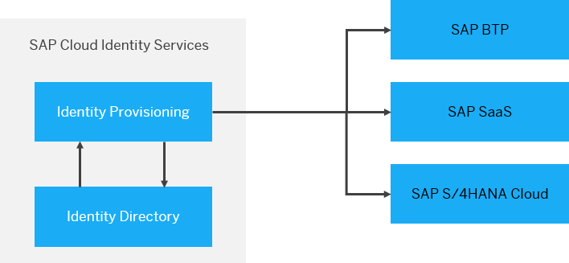
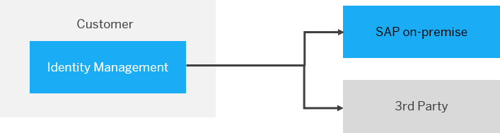

<!-- loioc879f720bc7c4133ac859b18b7292193 -->

# Identity Lifecycle with an Identity Management Solution

In this identity lifecycle scenario, users are directly created within the SAP Cloud Identity Services, stored in the Identity Directory \(the SAP Cloud Identity Services persistency layer\) and provisioned to the SAP cloud applications. The following figure illustrates this landscape.

  
  
**SAP Cloud Identity Services managing SAP cloud applications**

SAP Cloud Identity Services \(in short, Cloud Identity Services\) offer default integrations for many SAP applications via [bundles](https://help.sap.com/docs/IDENTITY_PROVISIONING/f48e822d6d484fa5ade7dda78b64d9f5/5db6c8dcf7a347fe81e2a78c3df9ec50.html). The bundles ensure that during the SAP Cloud solution’s order fulfilment process, it is checked if a customer already has SAP Cloud Identity Services tenants. If not, by default two tenants will be created and pre-configured for out-of-the-box integrations between SAP solutions.

After the tenants have been \(automatically\) deployed, entities can be created directly in the SAP Cloud Identity Services as follows:

-   Users or groups are created manually, directly in the Identity Authentication admin console

-   Users create their own user accounts via self-registration – if configured

-   Users or groups are imported manually \(for example, via CSV file\)

-   Users or groups are programmatically provisioned via the [SCIM API](https://api.sap.com/api/IdDS_SCIM/overview)

During the creation of a user account, Cloud Identity Services assign and store a Global User ID. For more information, see [Global User ID in Integration Scenarios](../60-integration-scenarios/global-user-id-in-integration-scenarios-a04611d.md). This Global User ID uniquely identifies a user across SAP business applications and services. Therefore, it replaces the need for a correlation of different external user identifiers. It is also possible to provide a Global User ID instead of using the one generated by the Cloud Identity Services.

Once the users are available in Cloud Identity Services, they are replicated to the target applications by Identity Provisioning. The provisioning can be triggered manually, via scheduled jobs or in real-time. Identity Provisioning has dedicated [connectors](https://help.sap.com/docs/IDENTITY_PROVISIONING/f48e822d6d484fa5ade7dda78b64d9f5/ab3f641552464c79b94d10b9205fd721.html) for various SAP target applications making point-to-point connections obsolete. The connectors are optimized for the SAP cloud applications and in many cases, they are already pre-configured as part of the SAP bundled scenarios.

Based on the user information received from the Identity Provisioning, the SAP cloud applications create local users and store them in their local user store. The Global User ID provided by Identity Provisioning as part of the user information is also stored locally and mapped to an internal ID the application might have created for a specific user.

<a name="loioc879f720bc7c4133ac859b18b7292193__section_s2g_pby_qvb"/>

## Evolving On-Premise Setups to Hybrid Landscapes

Many SAP customers already have an Identity Management solution in place. This Identity Management might be connected to SAP on-premise systems, SAP systems and other 3rd Party solutions through point-to-point connections. The following figure illustrates this landscape.

  
  
**Most customers already have an Identity Management solution in place**

In this case, the identity access management administrator is responsible for creating and maintaining the point-to-point connections to the target applications. Any changes that might come regarding provisioning to target SAP SaaS applications, could mean extra effort at the customer side.

Introducing a new SAP cloud application that requires the SAP Cloud Identity Services leads to a change in the landscape.

> ### Recommendation:  
> If the central Identity Management solution must still directly control the provisioning flows, it is recommended to replicate the users from the Identity Management solution to the SAP Cloud Identity Services – Identity Directory. This will ensure a proper and integrated functionality for those applications or functionalities that rely on these services, such as [SAP Task Center](https://help.sap.com/docs/TASK_CENTER?version=Cloud) or SAP Business Technology Platform applications that will consume the [Authorization Management Service](https://help.sap.com/docs/IDENTITY_AUTHENTICATION/6d6d63354d1242d185ab4830fc04feb1/982ac5f91d2346fda8dd8096e861fc36.html). The latter is another component of the SAP Cloud Identity Services to centrally manage SAP SaaS applications.

The recommended target landscape is illustrated in the following figure.

  
  
**SAP Cloud Identity Services are the leading system in the provisioning flow**

In this case, Identity Provisioning is used for the user or group provisioning between SAP Cloud Identity Services and all SAP Cloud applications eliminating the need to maintain custom point-to-point connections. The Identity Management solution controls the provisioning to the on-premises systems and to the SAP Cloud Identity Services persistency layer - the Identity Directory. The central Identity Management solution is also in charge of the correctness and consistency of user data. It triggers centrally the creation, modification and deletion of identities.

