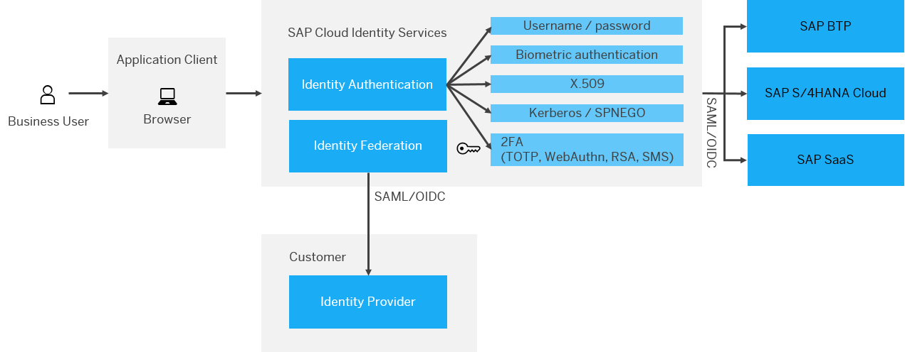

<!-- loio4970fecabf6b4848ac6403494bac7c8d -->

# Single Sign-On: Authentication with a Single SAP Cloud Identity Services Tenant and a Single Corporate Identity Provider

When you adopt SAP cloud products and integrate them into your system landscape, you choose an approach for identity access management \(IAM\). The approach you choose depends on the integration you want from the perspective of single sign-on, whether you have a unified, simple IAM landscape or whether you have a complex landscape in place.

Let's assume a typical hybrid landscape, where the authentication is delegated to a single tenant of SAP Cloud Identity Services. The tenant includes the Identity Authentication service, which is integrated with an existing corporate identity provider. The following figure illustrates this landscape.

  
  
**Hybrid Landscape with a Single SAP Cloud Identity Services Tenant and a Single Corporate Identity Provider**

SAP Cloud Identity Services are delivered with one productive and one test tenant per customer. When you have multiple SAP cloud products, they should all be integrated with the same SAP Cloud Identity Services tenant, so that single sign-on for business users is established by default.

If you want more than those two default tenants, you can license additional tenants through the SAP Store or the consumption-based licensing Cloud Platform Enterprise Agreement \(CPEA\).

In a typical model landscape, all SAP cloud applications delegate authentication to a single tenant, which integrates with the corporate identity provider.

During authentication, the end user is identified by a logon alias. Use meaningful, easy-to-remember attributes for human beings, for example:

-   E-mail address

-   Employee ID

-   Identifier based on semantics of the user’s name, such as. surname + digit

Multifactor authentication, if necessary, can be enforced either in the corporate identity provider or in Identity Authentication.

> ### Recommendation:  
> We recommend that you enforce the second factor in the identity provider, where users manage their first factor \(for example, their password\). Therefore, employees ideally manage and validate the second factor in the corporate identity provider.

After successful authentication, the identity provider sends an authentication response token to the service provider. The user, for whom this token is issued, is uniquely specified with the subject name identifier attribute. This federation identifier, used for the communication between the identity provider and the business applications, doesn't need to be human readable. Above all, the federation identifier should be unique and immutable and thus the identifier should be stable over time. Preferred candidates are as follows:

-   Global User ID generated in SAP Cloud Identity Services

    For more information, see [Global User ID in Integration Scenarios](../60-integration-scenarios/global-user-id-in-integration-scenarios-a04611d.md).

-   An immutable unique identifier managed in your corporate identity provider

    This identifier must be provisioned before authentication to the business applications with an identity management solution.

This approach enables applications to receive security tokens not only for browser-based single sign-on, but also security tokens that can be leveraged for subsequent system-to-system communication. The advantage of protecting system-to-systems calls with a security token that contains the actual user information \(principal propagation\) is that the user context isn't lost. This way, evidence which user initiated the system call is provided.

For more information about principal propagation and how SAP BTP uses this concept, see [Principal Propagation](https://help.sap.com/docs/CP_CONNECTIVITY/cca91383641e40ffbe03bdc78f00f681/e2cbb48def4342048362039cc157b12e.html) in the documentation of SAP BTP Connectivity.

Overall, this IAM landscape enables flexible authentication that provides single sign-on for employee users with a corporate identity provider, while other users, such as partner or customer users, can authenticate in Identity Authentication.

**Related Information**  

[Multi-Factor Authentication](https://help.sap.com/docs/IDENTITY_AUTHENTICATION/6d6d63354d1242d185ab4830fc04feb1/596e7f8b3f0441aaa8736be6bb368d5f.html "Manage the multi-factor authentication user settings in the administration console for Identity Authentication.")

