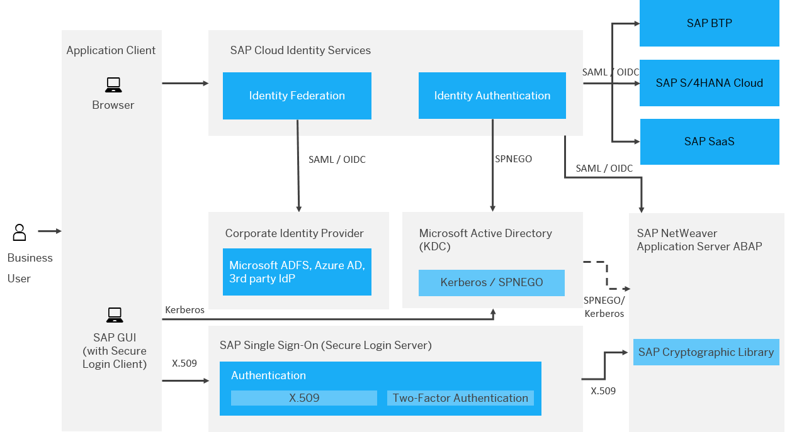

<!-- loioc7811a8ee88541518e9f5db731363223 -->

# Single Sign-On: Hybrid Authentication with Single SAP Cloud Identity Services Tenant and SAP SSO

This document describes a reference landscape with SAP NetWeaver ABAP on-premise systems involved that shall be accessed via SAP GUI.

Many SAP customers has adopted SAP cloud products and integrated them into their system landscape. The chosen Identity Access Management \(IAM\) approach depends on the desired integration from a single sign-on \(SSO\) perspective, whether a customer has a unified, simple IAM landscape or whether a customer has a rather complex landscape in place.

This reference landscape presents SAP NetWeaver ABAP on-premise systems that shall be accessed via SAP GUI.

The SAP Cloud Identity Services include Identity Authentication which is the solution to establish single sign-on for browser-based access to SAP applications. For more information, see [Single Sign-On: Authentication with a Single SAP Cloud Identity Services Tenant and a Single Corporate Identity Provider](single-sign-on-authentication-with-a-single-sap-cloud-identity-services-tenant-and-a-4970fec.md). Yet many customers still have SAP NetWeaver AS ABAP on-premise systems in use. Often these ABAP systems are accessed via SAP GUI and this desktop client does not support SSO protocols like SAML or OpenID Connect. For that reason SAP Single Sign-On is commonly used to facilitate single sign-on with either X.509 certificates or Kerberos as authentication mechanism. For more information, see [Secure Login for SAP Single Sign-On Implementation Guide](https://help.sap.com/docs/SAP_SINGLE_SIGN-ON/df185fd53bb645b1bd99284ee4e4a750/631b1669678d41d79d94601c238e218b.html). Thus, end users will benefit from single sign-on to both browser-based SAP applications as well as access with desktop clients. Multifactor authentication can be enforced for both scenarios in Identity Authentication or SAP Single Sign-On.

**Related Information**  

[SAP Single Sign-On](https://help.sap.com/docs/SAP_SINGLE_SIGN-ON)

