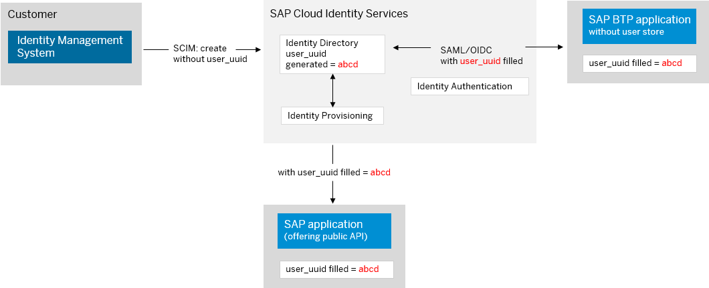
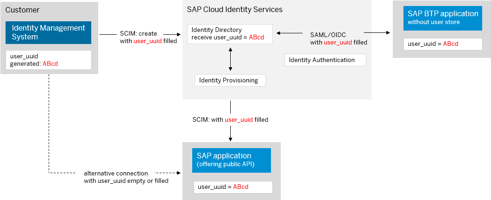

<!-- loioa04611df60404a248a7a8089c85b9761 -->

# Global User ID in Integration Scenarios

Using Global User ID addresses the challenge of integrating user-related data across system boundaries. It provides the means for establishing an enterprise-wide mapping of users for the purposes of integration scenarios which require a common user identifier.


<a name="loioa04611df60404a248a7a8089c85b9761__section_rcl_kcw_ztb"/>

## Overview

For integration scenarios with SAP applications, such as SAP Task Center, you need a common identifier for the users in your system landscape. This common identifier is the Global User ID which acts as a correlation attribute. Its value uniquely identifies a user across the landscape and helps the SAP Task Center relate tasks from different systems to that user.

There are two approaches for implementing Global User ID:

-   **Recommended Approach**: Use SAP Cloud Identity Services - Identity Authentication and Identity Provisioning to generate and distribute Global User ID.

    In this case, the attribute is automatically generated by Identity Authentication at user creation. Its value is populated in the *Global User ID* field for every newly created, imported or provisioned user. After that, Identity Provisioning distributes it to various SAP applications.

    

    > ### Recommendation:  
    > We recommend that you generate and distribute Global User ID using SAP Cloud Identity Services. This applies especially for new customers who haven't implemented the concept of Global User ID.

-   **Alternative Approach**: Use your own value for Global User ID and distribute it to SAP applications.

    -   When distributing your own value with SAP Cloud Identity Services, Identity Authentication is used as a user store. It receives the value in the *Global User ID* field for every newly created, imported or provisioned user. After that, Identity Provisioning distributes it to various SAP applications.

        The *Global User ID* field cannot be empty. If you do not provide a value for Global User ID, Identity Authentication generates one for your users.

    -   When distributing your own value without SAP Cloud Identity Services, you use your existing identity management processes to provision it to SAP applications \(as outlined by the dotted line in the diagram below\).


    

    > ### Caution:  
    > You are allowed to generate and distribute your own Global User ID only when all applications in your landscape support it. If you start using it too early, there might be inconsistencies in your landscape without the possibility to correct them.


<a name="loioa04611df60404a248a7a8089c85b9761__section_x4d_lcw_ztb"/>

## Main Characteristics

These are the main characteristics of Global User ID when generated by SAP Cloud Identity Services - Identity Authentication or provided by the customer:


<table>
<tr>
<th valign="top">

 


</th>
<th valign="top">

SAP Generated ID


</th>
<th valign="top">

Customer Generated ID


</th>
</tr>
<tr>
<td valign="top">

**Character Set** 


</td>
<td valign="top">

List of allowed characters:

0-9, a-f, minus \(-\)

For more information, see [RFC 4122](https://datatracker.ietf.org/doc/html/rfc4122): *A Universally Unique IDentifier \(UUID\) URN Namespace*


</td>
<td valign="top">

List of allowed characters:

0-9, a-z, A-Z, minus \(-\), plus \(+\), underscore \(\_\), forward slash \(/\), colon \(:\), dot \(.\)

The at-sign \(@\) is excluded from the valid character set, therefore the email address cannot be used as a Global User ID.


</td>
</tr>
<tr>
<td valign="top">

**Length** 


</td>
<td valign="top">

The attribute value is 36 characters long \(32 hexadecimal characters and 4 hyphens\) and is lower-case only.

For example: `f81d4fae-7dec-11d0-a765-00a0c91e6bf6`


</td>
<td valign="top">

The attribute value consists of a maximum of 36 characters. It is case-sensitive.

For example:

`1234e567-e89b-12d3-a456-789614174000`

`MyTestGlobalUserId_1234567890/abcdef`

Each application must ensure that different users don't have the same Global User ID.


</td>
</tr>
<tr>
<td valign="top" rowspan="2">

**Controlled By** 


</td>
<td valign="top">

SAP

The Global User ID value is generated and owned by the SAP Cloud Identity Services - Identity Authentication. It is specific to one tenant of Identity Authentication.

It is mandatory that you use Identity Authentication as a user store for Global User ID.


</td>
<td valign="top">

Customer

The customer is in control of the Global User ID. He has the choice to generate a new ID or to use an existing one.

SAP Task Center and other SAP BTP applications require that Identity Authentication is used at least as a user store.


</td>
</tr>
<tr>
<td valign="top" colspan="2">

This value can be sent from Identity Authentication to applications as `user attribute`, `Subject Name Identifier`, and default attribute in the SAML assertion. The Global User ID is also sent as part of the `id_token` if the application uses OpenID connect.


</td>
</tr>
<tr>
<td valign="top">

**Mutability** 


</td>
<td valign="top" colspan="2">

The value is mutable.

When the Global User ID is generated by Identity Authentication in the *Global User ID* field or its value is imported \(provisioned\) to Identity Authentication by the customer, changing it is an exceptional case, therefore not recommended.

If you change the Global User ID in Identity Authentication, you must ensure that the new value is distributed to all dependent applications.


</td>
</tr>
<tr>
<td valign="top">

**Provisioning** 


</td>
<td valign="top">

It is mandatory that you use Identity Provisioning

The Global User ID is provisioned by the Identity Provisioning using the SCIM attribute `userUuid` as part of the `urn:ietf:params:scim:schemas:extension:sap:2.0:User` namespace.


</td>
<td valign="top">

Two options are available:

-   Use Identity Provisioning.

-   Use existing provisioning processes.


</td>
</tr>
</table>


<a name="loioa04611df60404a248a7a8089c85b9761__section_cbj_rxm_15b"/>

## Using Identity Provisioning

If Identity Provisioning is used for provisioning your own value to Identity Authentication, you need to modify the respective source system and Identity Authentication target system transformations.

For example:

In the source system read transformation, add the source and target path, as follows:

> ### Code Syntax:  
> ```
> {
>    "sourcePath":"<the attribute you want to use for Global User ID>",
>    "optional":true,
>    "targetPath":"$['urn:ietf:params:scim:schemas:extension:sap:2.0:User']['userUuid']"
> },
> ​
> ```

In the Identity Authentication target system write transformation, add the source and target path, as follows:

> ### Code Syntax:  
> ```
> {
>    "sourcePath":"$['urn:ietf:params:scim:schemas:extension:sap:2.0:User']['userUuid']",
>    "optional":true,
>    "targetPath":"$['urn:ietf:params:scim:schemas:extension:sap:2.0:User']['userUuid']"
> },
> 
> ```

-   **[Usage of Global User ID](usage-of-global-user-id-5dcc5a6.md "The Global User ID identifier is immutable and unique across technology layers such as
		user interfaces, APIs, and security tokens, as well as across products and lines of business
		contributing to a business process in the Intelligent Enterprise. ")**  
The Global User ID identifier is immutable and unique across technology layers such as user interfaces, APIs, and security tokens, as well as across products and lines of business contributing to a business process in the Intelligent Enterprise.

**Related Information**  


[Usage of Global User ID](usage-of-global-user-id-5dcc5a6.md "The Global User ID identifier is immutable and unique across technology layers such as user interfaces, APIs, and security tokens, as well as across products and lines of business contributing to a business process in the Intelligent Enterprise.")

